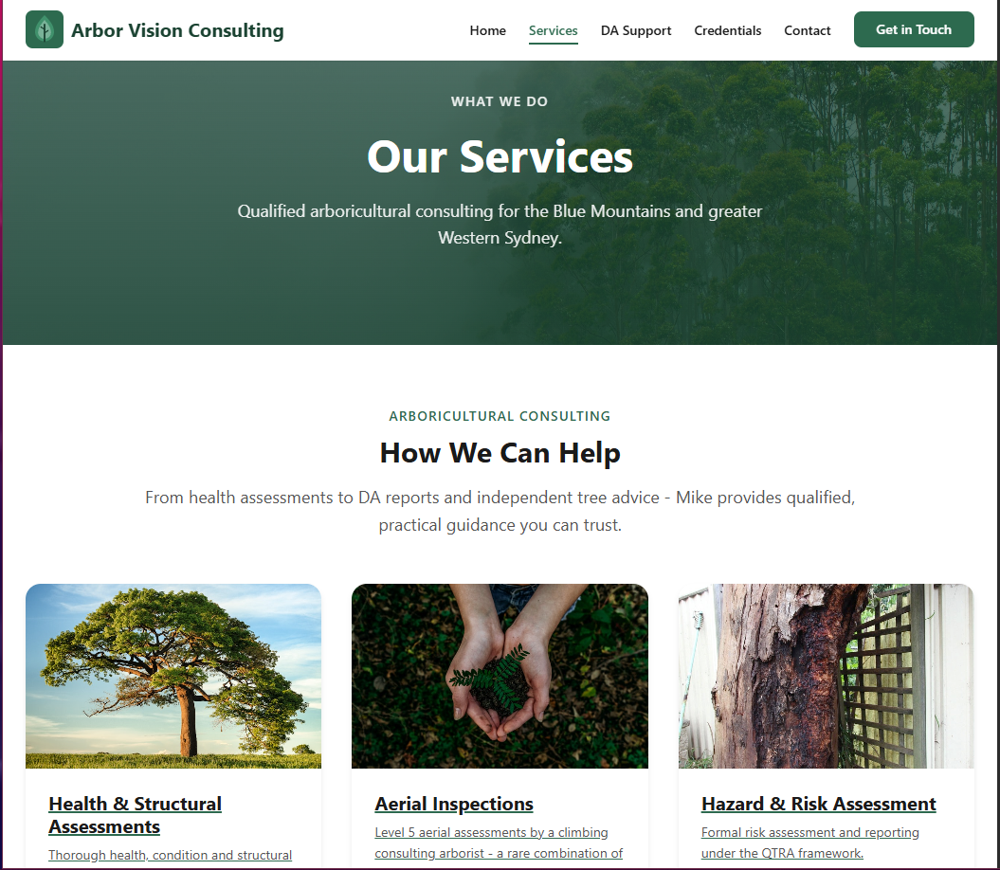
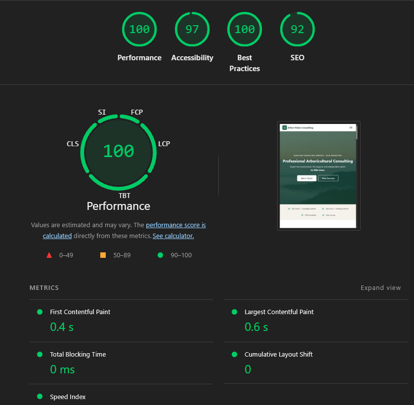

# Arbor Vision Consulting v2

Professional **Arbor Vision Consulting** website for **Mike Daws** built as a lightweight, mobile-first, SEO-strong static site using [Eleventy (11ty)](https://www.11ty.dev/).



[New DEMO Site](https://mike.preview.serenity-webcrafts.com.au) 

[OLD Live Site](https://www.arborvision.consulting/) <!-- Update with the actual deployed URL when available -->


## Principles

- **Mobile-first** : designed for phones first, scales up gracefully.
- **Performance** : static HTML, tiny CSS, minimal JS modules. No frameworks.
- **SEO** : semantic HTML, structured data (JSON-LD), meta tags, sitemap, robots.txt.
- **Accessibility** : keyboard navigation, focus-visible, respects `prefers-reduced-motion`.
- **No contact form** : calls and emails only (click-to-call, click-to-email).

## Quick Start

```bash
# Install dependencies
npm install

# Start dev server with live reload
npm run dev

# Production build
npm run build
```

## Project Structure

```
src/
├── _data/          # Global data files (site.json)
├── _includes/
│   ├── layouts/    # Page layouts (base.njk)
│   └── partials/   # Reusable components (head, header, footer, etc.)
├── assets/
│   ├── css/        # Stylesheets (base.css, layout.css, components.css)
│   ├── js/         # Tiny ES modules (main.js, nav.js, reveal.js, carousel.js)
│   ├── images/     # Site images
│   ├── icons/      # Favicons, SVG icons
│   └── video/      # Hero video assets
├── pages/          # Site pages (index, services, DA support, credentials, contact, etc.)
└── static/         # Files copied as-is (robots.txt, favicon.ico)
```

## Build Output

The production build outputs to `_site/`. Deploy this folder to any static host.

## Documentation

| Document | Description |
|----------|-------------|
| [TechStack.md](TechStack.md) | Typography, colour schema, CSS architecture, JS modules |
| [SEO_Optimizations.md](SEO_Optimizations.md) | Local SEO checklist, Google Business Profile, keyword targets |
| [CONTENT_CHECKLIST.md](CONTENT_CHECKLIST.md) | Remaining content items and in-code TODOs |
| [Deployment.md](Deployment.md) | Hosting instructions for Vultr VPS + Coolify |
| [ASSET_GUIDE.md](ASSET_GUIDE.md) | Image and asset management guide |

## Deploy Notes

- Ensure all placeholder content (marked with `<!-- TODO: ... -->`) is replaced before deploying.
- Run `npm run build` and check the `_site/` folder for the final output.
- No server-side runtime required, pure static files.
- See [Deployment.md](Deployment.md) for full VPS hosting instructions.

## Lighthouse Performance Analysis



